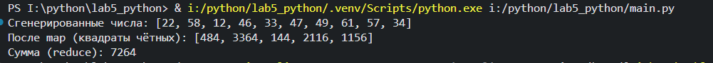
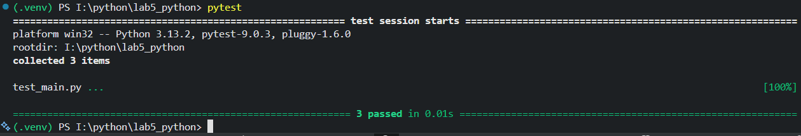

# Лабораторная работа №5 — Генераторы

## Условие
Реализовать генератор случайных чисел без использования встроенных ГПСЧ.
Отфильтровать числа по количеству делителей.

## Описание решения
- Использован линейный конгруэнтный генератор (LCG)
- Добавлена фильтрация по количеству делителей
- Применены:
  - filter — фильтрация чётных чисел
  - map — возведение в квадрат
  - reduce — вычисление суммы
- Реализованы тесты на pytest

## Вывод программы

## Результаты тестов

## Используемые материалы
- Документация Python
- https://docs.python.org/3/
